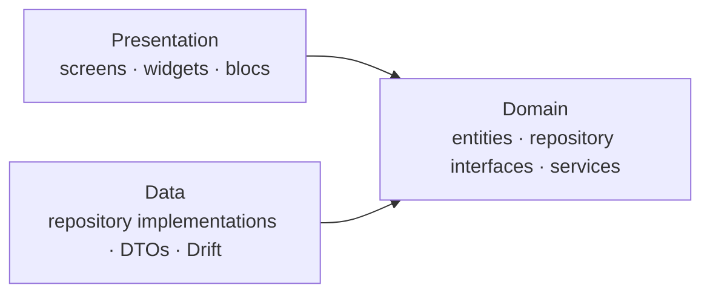

<p align="center">
  
</p>

<h1 align="center">Cashund</h1>

<p align="center">
  Your money, watched over by a good dog. A private, offline expense tracker for iOS and Android.
</p>

<p align="center">
  <a href="https://github.com/LjubijankicAmir/cashund/actions/workflows/ci.yml"></a>
  
  
</p>

---

Cashund tracks your incomes and expenses without an account, a server or an internet connection. Everything lives in a database on your phone. Biscuit, a dachshund buddy, keeps an eye on your spending: he gives you a heads-up when you're close to a limit you've set and cheers when you've spent less than planned.

> **Status:** early development. The project foundation is in place; features land phase by phase (see [Roadmap](#roadmap)).

## Features

- **Manual tracking** of expenses and incomes, each with a category
- **Your own categories**, separate for expenses and incomes, each with an emoji and a color
- **A calm dashboard** with day, week and month views that shows what matters and nothing more
- **Detailed statistics** with charts for when you want to dig deeper
- **Soft spending limits** per category and period, with friendly warnings instead of hard blocks
- **On-device AI import** that reads receipts and card statements. The model runs on your phone, so your data never leaves it
- **Light and dark themes**, designed as equals

## Roadmap

| Phase | Scope | Release |
| --- | --- | --- |
| 0. Foundation | Architecture, theme, DI, routing, localization, database, CI | |
| 1. Core | Transactions, categories, dashboard, search and filters | `v0.1.0` |
| 2. Insights | Statistics, spending limits, the buddy's messages, backup and export | `v0.2.0` |
| 3. Smart import | Receipt and statement scanning with an on-device model, review before saving | `v1.0.0` |

## Tech stack

| Concern | Choice |
| --- | --- |
| State management | [flutter_bloc](https://pub.dev/packages/flutter_bloc) |
| Local database | [Drift](https://pub.dev/packages/drift) (SQLite) |
| Dependency injection | [get_it](https://pub.dev/packages/get_it) + [injectable](https://pub.dev/packages/injectable) |
| Routing | [auto_route](https://pub.dev/packages/auto_route) |
| Error handling | [fpdart](https://pub.dev/packages/fpdart) `Either` |
| Immutable models | [freezed](https://pub.dev/packages/freezed) |
| Localization | `gen_l10n` with ARB files |
| Linting | [very_good_analysis](https://pub.dev/packages/very_good_analysis) |

## Architecture

Cashund follows a layer-first clean architecture with three layers. Dependencies point inward: presentation and data both depend on the domain, and the domain depends on nothing.



```
lib/
├── core/           # Cross-cutting setup: DI, theme, routing, l10n, error types
├── data/           # Datasources (Drift), DTOs and repository implementations
├── domain/         # Entities, repository interfaces, value objects, domain services
└── presentation/   # One folder per feature: bloc, screens, widgets
```

- **Blocs talk to repositories directly.** There are no use-case classes. Logic that spans several repositories, such as evaluating spending limits, lives in pure-Dart domain services.
- **Errors are values.** Repositories return `Result<T>` (`Either<Failure, T>`) instead of throwing, so every failure path is visible in the types.
- **Repositories are interfaces in the domain** and implemented in the data layer, which keeps blocs testable with simple fakes.

## Getting started

Requires Flutter **3.47** or newer.

```bash
flutter pub get
dart run build_runner build
flutter run
```

Generated code (`*.g.dart`, `*.freezed.dart`, `*.gr.dart`, `*.config.dart`) isn't committed. Run `build_runner` after cloning or pulling, or keep `dart run build_runner watch` running while you work.

```bash
flutter analyze
flutter test
```

## Contributing

Work happens on feature branches that are squash-merged into `main` through pull requests. Commit messages and PR titles follow [Conventional Commits](https://www.conventionalcommits.org/) (`feat(limits): add weekly limit warnings`), and CI checks formatting, analysis, tests and an Android build on every PR.

## License

The source code is available under the [MIT License](LICENSE).

The Cashund name, the Biscuit character, the app icon and the splash artwork are not covered by that license. Please don't use them in your own published apps. The bundled fonts, [Fredoka](assets/fonts/Fredoka-OFL.txt) and [Figtree](assets/fonts/Figtree-OFL.txt), are licensed under the SIL Open Font License 1.1.
